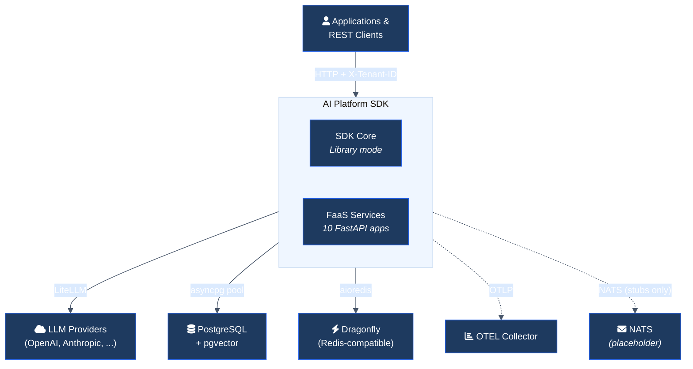
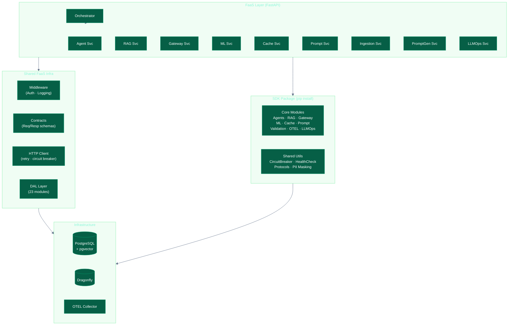
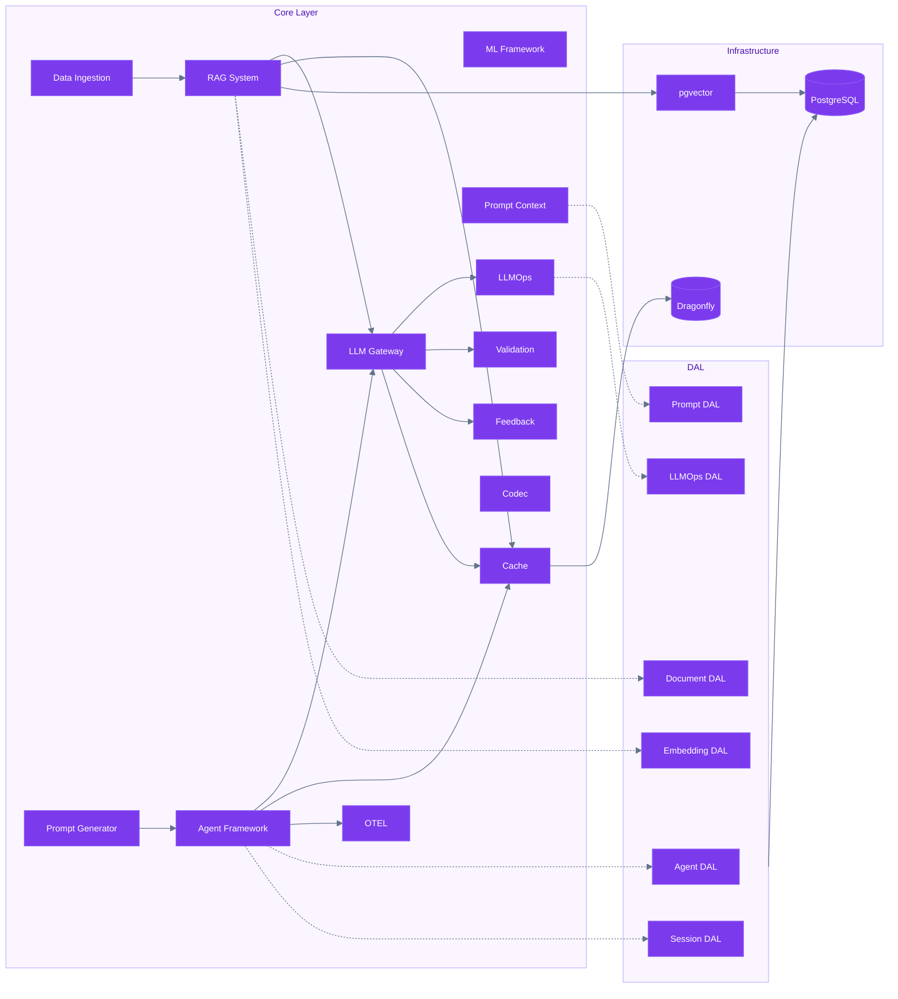
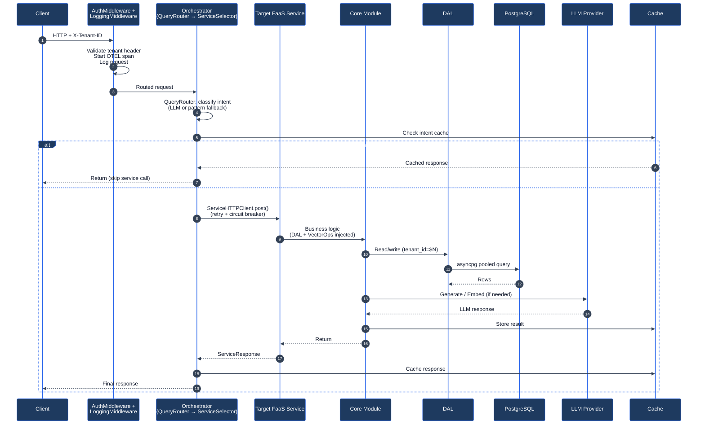
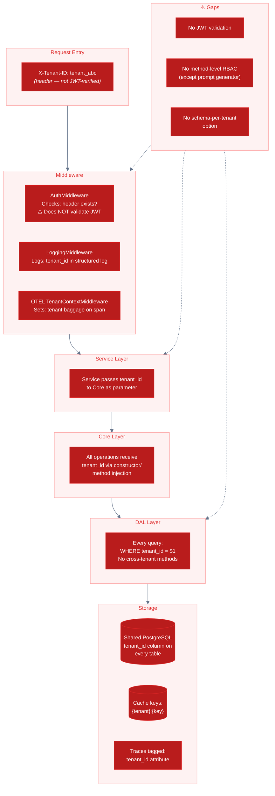

# AI Platform SDK — Enterprise Architecture Presentation

**Prepared for:** Department Heads & Senior Architects  
**Domain:** SaaS ITSM Platform  
**Methodology:** Evidence-based; every claim references code artefacts  
**Convention:** (A) = evidenced in code/config. (B) = recommended improvement / gap.

---

# DELIVERABLE 1 — Slide-Ready Architecture Deck

---

## Slide 1: Executive Overview

**Slide title:** What This Is, Why It's Built This Way, and Where It Stands

**Bullets:**

- A Python SDK providing modular AI capabilities (agents, RAG, ML, LLM gateway, caching) for a SaaS ITSM platform. (A)
- Architectural pattern: **Modular Monolith with a FaaS decomposition seam** — Core logic ships as a library; each capability is also exposed as a stateless REST service. (A)
- Data-access discipline: a dedicated DAL (23 modules) sits between business logic and PostgreSQL; Core never executes raw SQL. (A)
- Current maturity: **Alpha** (`version = "0.1.0"`, `Development Status :: 3 - Alpha`). CI via Azure Pipelines with SonarCloud quality gate. No Dockerfile, no Kubernetes manifests in repo. (A)
- Coverage gate set to `fail_under = 85` in `pyproject.toml`. ML modules explicitly excluded from coverage. (A)

**Speaker notes:**

We are presenting a v0.1 alpha SDK. The architecture is intentionally layered for a monolith-to-services transition. Right now it ships and runs as a single deployable. Each FaaS service is a FastAPI app, but no container images exist yet — containerisation is documented but not implemented. The 85% coverage gate is enforced in CI; ML modules are carved out because they are in early development.

**Evidence:**

| Claim | Source |
|-------|--------|
| Version "0.1.0" / Alpha | `pyproject.toml:7-8`, `src/__init__.py:10` |
| 23 DAL modules | `src/faas/shared/dal/__init__.py` (23 imports) |
| Coverage gate 85% | `pyproject.toml:158` (`fail_under = 85`) |
| ML excluded from coverage | `pyproject.toml:143-144` |
| Azure Pipelines CI | `azure-pipelines.yml` |
| No Dockerfile | Verified: no `Dockerfile` in repository |

---

## Slide 2: C4 Context — System Boundary

**Slide title:** Who Talks to the System and What's Outside

**Bullets:**

- **Users/consumers:** Applications, REST clients, serverless triggers — all via HTTP with `X-Tenant-ID` header. (A)
- **External LLM providers:** OpenAI, Anthropic, and others via LiteLLM abstraction. (A)
- **External database:** PostgreSQL with pgvector extension for vector embeddings. (A)
- **External cache:** Dragonfly (Redis-compatible) for distributed caching. (A)
- **Optional integrations:** NATS (messaging), OTEL Collector (tracing), CODEC (serialisation) — all feature-flagged. (A)
- (B) **Not evidenced:** No API gateway (e.g. Kong, AWS API Gateway) configuration in repo. Orchestrator acts as internal router only.

**Speaker notes:**

The system boundary is clear: clients connect via HTTP, LLM providers are accessed through a unified gateway, and persistence is PostgreSQL. NATS, OTEL, and CODEC are toggled via `ENABLE_NATS`, `ENABLE_OTEL`, `ENABLE_CODEC` environment flags. There is no external API gateway configuration — the orchestrator provides internal routing but not edge concerns like external rate limiting, API key management, or IP whitelisting.

**Evidence:**

| Claim | Source |
|-------|--------|
| LiteLLM multi-provider | `src/core/litellm_gateway/gateway.py`, `requirements.txt` (litellm, openai, anthropic) |
| PostgreSQL + pgvector | `src/core/postgresql_database/connection.py` (DatabaseConnection), `vector_operations.py` |
| Dragonfly | `.env.example:34` (`DRAGONFLY_URL`) |
| Feature flags | `.env.example:56-58` (`ENABLE_NATS`, `ENABLE_OTEL`, `ENABLE_CODEC`) |
| NATS placeholder | `src/faas/integrations/nats.py` (publish stubs, no subscribers) |

---

## Slide 3: C4 Container — Deployable Units

**Slide title:** What Gets Deployed

**Bullets:**

- **SDK (Python package):** `motadata-python-ai-sdk`, setuptools build, pip-installable. Contains Core and can be used as a library. (A)
- **10 FaaS services:** Agent, RAG, Gateway, ML, Cache, Prompt, Data Ingestion, Prompt Generator, LLMOps, Orchestrator — each is a FastAPI app with `uvicorn`. (A)
- **PostgreSQL:** Primary data store; pgvector for embeddings; `asyncpg` pool for async access. (A)
- **Dragonfly:** Distributed cache backend (Redis wire-compatible). Falls back to in-memory LRU. (A)
- **OTEL Collector:** Receives traces and metrics via OTLP protocol. (A – integration code exists)
- (B) **Not evidenced:** No container images, no Kubernetes manifests, no Docker Compose in repo. Deployment is documented in `docs/deployment/` but not implemented.

**Speaker notes:**

Today, this deploys as a Python package or as individual FastAPI processes. There is no container story in the repo — Dockerfiles and K8s manifests are documentation-only. Each FaaS service follows the same pattern: FastAPI app, shared middleware stack, standard request/response contracts, and optional NATS/OTEL/CODEC. The database connection uses asyncpg with configurable pool sizes.

**Evidence:**

| Claim | Source |
|-------|--------|
| Setuptools build | `pyproject.toml:2` (`setuptools.build_meta`) |
| FastAPI + uvicorn | `pyproject.toml:46-47`, every `services/*/service.py` |
| 10 services | `src/faas/services/` (10 subdirectories, each with `service.py`) |
| asyncpg pool | `src/core/postgresql_database/connection.py` (DatabaseConnection) |
| No Dockerfile | Verified: no `Dockerfile` in repo root or service dirs |

---

## Slide 4: C4 Component — Top Modules and Their Contracts

**Slide title:** Core Components and How They Connect

**Bullets:**

- **Agent Framework** — `Agent`, `AgentManager`, `AgentOrchestrator`, `WorkflowPipeline`, `ToolRegistry`, `AgentMemory`. Depends on: Gateway, Cache, OTEL. (A)
- **RAG System** — `RAGSystem`, `DocumentProcessor`, `Retriever`, `RAGGenerator`, `HallucinationDetector`. Depends on: Gateway, VectorOperations, DocumentDAL, Cache. (A)
- **LLM Gateway** — `LiteLLMGateway`, `RateLimiter`, `RequestBatcher`, `RequestDeduplicator`. Depends on: LiteLLM (external), Cache, LLMOps, Validation. (A)
- **ML Framework** — `MLSystem`, `Trainer`, `Predictor`, `ModelRegistry`, `MLOpsPipeline`, `DriftDetector`, `ModelServer`. Depends on: DB, Cache. (A)
- **PostgreSQL / pgvector** — `DatabaseConnection`, `VectorOperations`, `VectorIndexManager`. Depends on: asyncpg. (A)
- **Cache Mechanism** — `CacheMechanism` with LRU and Dragonfly backends. Depends on: aioredis (optional). (A)
- **OTEL Integration** — `OTELTracer`, `OTELMetrics`, auto-instrumentation for FastAPI/httpx/asyncpg. (A)
- **Contracts boundary:** `StandardHeaders`, `ServiceRequest`, `ServiceResponse`, `ErrorResponse` in `contracts.py`. (A)
- **Protocol-based typing:** `GatewayProtocol`, `AgentProtocol`, `ToolProtocol`, `CacheProtocol` in `utils/type_helpers.py`. (A)
- (B) **Not evidenced:** `interfaces.py` referenced in README and docs but does not exist. Protocols in `type_helpers.py` partially fill this role.

**Speaker notes:**

The component map has 16 Core modules. The top 8 are production-relevant. The contract boundary between FaaS and Core is defined by Pydantic models in `contracts.py` and Python Protocols in `type_helpers.py`. The README references an `interfaces.py` for formal component contracts — this file does not exist. The Protocols in `type_helpers.py` are a partial substitute but are not enforced at runtime.

**Evidence:**

| Claim | Source |
|-------|--------|
| Agent classes | `src/core/agno_agent_framework/agent.py`, `orchestration.py`, `memory.py`, `tools.py` |
| RAG classes | `src/core/rag/rag_system.py`, `retriever.py`, `generator.py`, `hallucination_detector.py` |
| Gateway classes | `src/core/litellm_gateway/gateway.py`, `rate_limiter.py` |
| Contracts | `src/faas/shared/contracts.py` (StandardHeaders, ServiceRequest, ServiceResponse) |
| Protocols | `src/core/utils/type_helpers.py:20,51,61,82` |
| interfaces.py missing | Referenced in README; file does not exist in repo |

---

## Slide 5: Dependency Direction & Boundaries

**Slide title:** What Can Import What — and Why It Matters

**Bullets:**

- **Rule 1: Core never imports FaaS.** Business logic has zero knowledge of REST, FastAPI, or service boundaries. (A)
- **Rule 2: Core never executes raw SQL.** All persistence through DAL modules or VectorOperations. (A — with exceptions noted below)
- **Rule 3: FaaS services are stateless.** Component instances created on-demand per request via factory functions. (A)
- **Rule 4: DAL is the sole holder of `DatabaseConnection`.** Swapping PostgreSQL only requires replacing DAL implementations. (A)
- **Pragmatic breach:** Some Core modules accept optional DAL references via constructor injection (`rag_system.py`, `memory.py`, `orchestration.py`). This enables library mode (no DAL) and service mode (DAL injected) without branching. (A)
- (B) **Risk:** The optional DAL injection means the boundary is enforced by convention, not by the type system. A developer can accidentally bypass DAL.

**Speaker notes:**

The dependency direction is Application → DAL → Core → Infrastructure. This is the most important architectural property. Core works as a standalone library with in-memory persistence. When deployed as a service, DAL is injected. The pragmatic breach is intentional — it avoids duplicating persistence logic — but it creates a risk that a future developer adds direct SQL in Core. Recommendation: enforce the boundary with a linting rule or architectural fitness function.

**Evidence:**

| Claim | Source |
|-------|--------|
| Core has no FastAPI imports | Verified: `src/core/` contains no `from fastapi` imports |
| DAL constructor injection in Core | `src/core/rag/rag_system.py` (accepts `document_dal`, `vector_ops`), `src/core/agno_agent_framework/memory.py` |
| Factory functions | `src/core/agno_agent_framework/functions.py` (`create_agent`), `src/core/rag/functions.py` (`create_rag_system`) |
| Stateless services | Every `service.py` creates Core instances in method scope, not at module level |

---

## Slide 6: Request Lifecycle

**Slide title:** End-to-End Flow: What Happens When a Request Arrives

**Bullets:**

- **Entry:** Client → HTTP request with `X-Tenant-ID`, `X-User-ID`, `X-Correlation-ID` headers. (A)
- **Middleware stack:** `AuthMiddleware` (reject if no tenant) → `LoggingMiddleware` (timing + structured log) → `error_handler` (maps exceptions to JSON). (A)
- **Orchestration path:** Orchestrator → `QueryRouter` (LLM-based + pattern fallback intent classification) → `ServiceSelector` (intent → service + endpoint) → `ServiceHTTPClient` (retry + circuit breaker) → target service. (A)
- **Direct path:** Client → specific FaaS service directly (bypasses orchestrator). (A)
- **Core execution:** Service → Core module → DAL for persistence → LLM Gateway for generation → Cache for response storage. (A)
- **Sync only.** NATS publish stubs exist in every service but no subscribers are implemented — all communication is synchronous HTTP. (A)
- (B) **Gap:** No async job queue for long-running operations (ML training, batch embedding). All operations block the request thread.

**Speaker notes:**

There are two entry paths: through the orchestrator (smart routing) or directly to a service. The orchestrator uses LLM-based intent classification with a pattern-based fallback. All inter-service communication is synchronous HTTP via `ServiceHTTPClient` with retry and circuit breaker. NATS stubs are in every service — they publish events like `agent.created` and `rag.document.ingested` — but no consumer subscribes to them. This means event-driven patterns are architecturally prepared but not functional. For ML training and batch embedding, the lack of an async job queue is a concrete risk: a training request will block a service thread for potentially minutes.

**Evidence:**

| Claim | Source |
|-------|--------|
| AuthMiddleware | `src/faas/shared/middleware.py:71` (AuthMiddleware class) |
| LoggingMiddleware | `src/faas/shared/middleware.py:23` |
| QueryRouter | `src/faas/orchestrator/query_router.py` |
| ServiceSelector | `src/faas/orchestrator/service_selector.py` |
| ServiceHTTPClient + retry + circuit breaker | `src/faas/shared/http_client.py:41` |
| NATS publish stubs, no subscribers | `src/faas/integrations/nats.py` (placeholder publish) |

---

## Slide 7: Data Architecture

**Slide title:** Who Owns What Data, and How Tenancy Works

**Bullets:**

- **Storage:** Single PostgreSQL instance with pgvector extension. All tables are tenant-scoped (shared schema, `tenant_id` column). (A)
- **23 DAL modules** manage ~30 tables across 7 domains: Agent, RAG, ML, Prompt, Platform, Orchestrator, Tenant. (A)
- **Vector storage:** `embeddings` table with pgvector; supports IVFFlat and HNSW indexes via `VectorIndexManager`. (A)
- **Caching:** Three-tier — gateway response cache, RAG query cache, orchestrator intent cache. Backend: in-memory LRU or Dragonfly. (A)
- **Tenant isolation:** `WHERE tenant_id = $N` on every DAL query. No cross-tenant query method exists in any DAL. (A)
- (B) **Gap:** No database migration framework (Alembic, Flyway). Tables are created by DAL `_ensure_table_exists()` methods — DDL mixed with application code.
- (B) **Gap:** No read-replica configuration. All reads and writes go to the same connection pool.

**Speaker notes:**

The data architecture is simple and pragmatic for an alpha product. One PostgreSQL instance, shared schema, tenant column on everything. The DAL boundary is strong — 23 modules covering all entity types. The main risk is schema management: there is no Alembic or equivalent migration framework. Each DAL module contains `_ensure_table_exists()` which runs `CREATE TABLE IF NOT EXISTS` on first access. This works for development but is not viable for production schema evolution. Recommendation: introduce Alembic with versioned migrations before any production deployment.

**Evidence:**

| Claim | Source |
|-------|--------|
| 23 DAL modules | `src/faas/shared/dal/__init__.py` (23 imports/exports) |
| VectorIndexManager (IVFFlat, HNSW) | `src/core/postgresql_database/vector_index_manager.py` |
| tenant_id on every DAL query | Verified in: `document_dal.py`, `agent_dal.py`, `session_dal.py`, `embedding_dal.py`, etc. |
| _ensure_table_exists() | Present in multiple DAL files (e.g., `agent_dal.py`, `document_dal.py`) |
| No Alembic | No `alembic.ini`, `alembic/` directory, or `alembic` in `requirements.txt` |

---

## Slide 8: Security Architecture

**Slide title:** Authentication, Authorisation, Secrets, and Audit

**Bullets:**

- **Authentication:** `AuthMiddleware` validates `X-Tenant-ID` header presence. Health endpoints exempt. (A)
- **Tenant context:** `TenantContextMiddleware` in OTEL module extracts tenant from JWT claims or subdomain. (A)
- **RBAC:** `AccessControl` with `Permission` and `ResourceType` enums — implemented only for prompt-based generator. (A)
- **Secrets:** All credentials from environment variables (`.env.example`). No hardcoded secrets in source. (A)
- **PII masking:** `mask_email`, `mask_phone`, `mask_ssn`, `mask_credit_card`, `mask_ip_address` in `utils/pii_masking.py`. (A)
- **Content guardrails:** `Guardrail` in `validation/guardrails.py` — PII filtering, secret detection, blocked patterns, ITSM compliance. (A)
- **Audit tables:** `llm_operations`, `gateway_request_history`, `rag_query_history`, `orchestrator_*_history`, `tool_executions`, `tenant_activity_history`, `faas_request_context`. (A)
- (B) **Gap:** No JWT validation logic in `AuthMiddleware`. It checks header presence only, not token signature or claims.
- (B) **Gap:** No method-level authorisation in Core modules. RBAC exists only in prompt generator.
- (B) **Gap:** No encryption-at-rest configuration. No TLS configuration in service code.

**Speaker notes:**

The security architecture has foundations (tenant header enforcement, PII masking, audit tables) but significant gaps for production. The `AuthMiddleware` checks that `X-Tenant-ID` exists but does not validate a JWT or any auth token. This means any client can impersonate any tenant by setting the header. The RBAC in the prompt generator is the only method-level access control — the rest of the system relies entirely on tenant-header trust. For production, we need: JWT validation with signature verification, method-level RBAC, and TLS termination (likely at a reverse proxy or API gateway, which is also missing).

**Evidence:**

| Claim | Source |
|-------|--------|
| AuthMiddleware — header check only | `src/faas/shared/middleware.py:71-100` (checks header presence, no JWT validation) |
| TenantContextMiddleware | `src/core/otel_integration/tenant_middleware.py` |
| AccessControl | `src/core/prompt_based_generator/access_control.py` |
| PII masking | `src/core/utils/pii_masking.py` |
| Guardrails | `src/core/validation/guardrails.py` |
| Audit tables | `src/faas/shared/dal/llmops_dal.py`, `gateway_request_history_dal.py`, `rag_query_history_dal.py`, etc. |

---

## Slide 9: Resilience

**Slide title:** Timeouts, Retries, Circuit Breakers, and Failover

**Bullets:**

- **Circuit breaker:** 3-state (`CLOSED`/`OPEN`/`HALF_OPEN`) with configurable `failure_threshold=5`, `success_threshold=2`, `timeout=60s`. (A)
- **Retry with backoff:** `ServiceHTTPClient` implements exponential backoff with configurable `max_retries=3`. (A)
- **Timeout:** Configurable on `ServiceHTTPClient` (`timeout=30.0`), gateway requests, database operations. (A)
- **Graceful degradation:** OTEL, NATS, CODEC integrations wrapped in try/except at import time — system runs without them. (A)
- **Health checks:** `HealthCheck` utility with status reporting; `health_check()` on `DatabaseConnection` and `VectorOperations`. (A)
- **Connection pooling:** `asyncpg` pool with configurable min/max. (A)
- (B) **Gap:** No backpressure mechanism. If downstream services are slow, the orchestrator will accumulate requests without shedding load.
- (B) **Gap:** No dead-letter queue or retry persistence. Failed async events (when NATS is activated) have no recovery path.

**Speaker notes:**

The resilience story is solid for synchronous paths: circuit breaker, retry, timeout, and health checks are all implemented and configurable. The graceful degradation for optional integrations is a mature pattern. The gaps are in async and overload scenarios: there is no backpressure, no load shedding, and no dead-letter mechanism. For production, we need at minimum a request queue with bounded size and rejection policy.

**Evidence:**

| Claim | Source |
|-------|--------|
| CircuitBreaker (3-state) | `src/core/utils/circuit_breaker.py:15-30` (CircuitState enum, CircuitBreakerConfig) |
| ServiceHTTPClient retry | `src/faas/shared/http_client.py:41` (max_retries, exponential backoff) |
| Graceful degradation | Verified: OTEL imports wrapped in try/except across Core modules |
| HealthCheck | `src/core/utils/health_check.py` |
| No backpressure | No queue size limit, no rejection policy in orchestrator or services |

---

## Slide 10: Scalability & Performance

**Slide title:** Hot Paths, Bottlenecks, and Scaling Levers

**Bullets:**

- **Hot path 1: LLM calls.** Rate limiter (token-bucket), request batcher, request deduplicator in gateway reduce call volume. (A)
- **Hot path 2: Vector search.** pgvector with IVFFlat/HNSW indexing; batch insert for embeddings. (A)
- **Hot path 3: Orchestrator routing.** Unified cache with query/conversation/semantic strategies reduces repeated intent classification. (A)
- **Scaling lever: Stateless services.** All FaaS services are stateless — horizontal scaling via load balancer. (A)
- **Scaling lever: Async I/O.** All Core and FaaS operations use `async/await` with `asyncio`. (A)
- **Scaling lever: Connection pooling.** `asyncpg` pool bounds concurrent DB connections. (A)
- **Bottleneck: Single PostgreSQL.** No read replicas, no sharding. Connection pool is the only mitigation. (A)
- (B) **Bottleneck: In-process ML.** Training and inference run in the request thread. No worker pool or job queue.
- (B) **Bottleneck: Orchestrator as funnel.** Single-threaded intent classification for all requests.

**Speaker notes:**

The three hot paths are LLM calls (cost + latency), vector search (latency), and orchestrator routing (throughput). The gateway has strong mitigation: rate limiting prevents provider throttling, batching groups similar requests, and deduplication ensures identical concurrent requests share one API call. Vector search benefits from pgvector indexing. The orchestrator caches intent classifications. The main bottleneck is the single PostgreSQL instance — for production, read replicas are essential. ML is the biggest scalability risk: training blocks the request thread with no offloading mechanism.

**Evidence:**

| Claim | Source |
|-------|--------|
| RateLimiter (token bucket) | `src/core/litellm_gateway/rate_limiter.py` |
| RequestBatcher, RequestDeduplicator | `src/core/litellm_gateway/rate_limiter.py` |
| VectorIndexManager (IVFFlat, HNSW) | `src/core/postgresql_database/vector_index_manager.py` |
| Orchestrator cache strategies | `src/faas/orchestrator/cache_strategy.py`, `cache_manager.py` |
| asyncpg pool | `src/core/postgresql_database/connection.py` |

---

## Slide 11: DevOps & Release Engineering

**Slide title:** CI/CD, Versioning, Packaging, and Environment Management

**Bullets:**

- **CI:** Azure Pipelines on `main` branch. Steps: Python 3.12, pip install, SonarCloud prepare, pytest with coverage, publish test results (JUnit), publish coverage (Cobertura), SonarCloud analyse + quality gate. (A)
- **Quality gates:** SonarCloud code analysis + coverage gate at 85% (`fail_under = 85`). SonarCloud waits for quality gate pass (`sonar.qualitygate.wait=true`). (A)
- **Packaging:** `pyproject.toml` with setuptools backend. Version `0.1.0`. Python >=3.8. (A)
- **Dev tooling:** black (formatting), isort (imports), mypy (type checking), pytest + pytest-asyncio + pytest-cov. (A)
- **Environment config:** `.env.example` (108 lines) with all config keys. `ServiceConfig` loads from environment. (A)
- (B) **Not evidenced:** No `Dockerfile`, no `docker-compose.yml`, no Kubernetes manifests, no Helm charts.
- (B) **Not evidenced:** No multi-environment config (dev/staging/prod). Single `.env.example`.
- (B) **Not evidenced:** No release pipeline (only build pipeline). No artifact publishing (PyPI, container registry).
- (B) **Not evidenced:** No pre-commit hooks configuration (`.pre-commit-config.yaml`).

**Speaker notes:**

The CI pipeline is functional: it runs tests, generates coverage, and gates on SonarCloud quality. But the release pipeline is absent — there is no mechanism to publish the SDK to PyPI or push container images. The dev tooling (black, isort, mypy) is configured in `pyproject.toml` but there is no pre-commit hook to enforce it locally. For production, we need: Dockerfiles per service, a release pipeline with semantic versioning, multi-environment config, and pre-commit hooks.

**Evidence:**

| Claim | Source |
|-------|--------|
| Azure Pipelines config | `azure-pipelines.yml` (84 lines) |
| SonarCloud project key | `azure-pipelines.yml:28` (`Motadata_motadata-python-sdk`) |
| Coverage fail_under=85 | `pyproject.toml:158` |
| black/isort/mypy config | `pyproject.toml:78-111` |
| No Dockerfile | Verified: no Dockerfile in repo |
| No pre-commit config | Verified: no `.pre-commit-config.yaml` |

---

## Slide 12: Governance & Compliance Readiness

**Slide title:** Auditability, Policy Controls, and Change Management

**Bullets:**

- **Audit trail:** 8 dedicated history/logging DAL modules track every LLM call, RAG query, agent action, orchestrator decision, prompt usage, and tenant activity. (A)
- **Cost governance:** `LLMOps` records token usage, model, cost, and latency per operation per tenant. (A)
- **OTEL trace persistence:** `otel_trace_context` table for long-term storage beyond collector retention. (A)
- **Correlation:** `X-Correlation-ID` header propagated through all service calls and logged in every middleware. (A)
- **Validation guardrails:** `ValidationManager` with chain-of-responsibility `Guardrail` instances for content filtering, format validation, and ITSM compliance. (A)
- **Exception hierarchy:** `SDKError` → domain errors (16 exception classes across 8 modules) with structured codes and context. (A)
- (B) **Gap:** No data retention policy enforcement. Audit tables grow unbounded.
- (B) **Gap:** No change-management workflow (approval gates, deployment sign-off) in CI/CD.

**Speaker notes:**

The auditability story is strong for an alpha: every significant AI operation is logged to a dedicated table with tenant context and correlation IDs. LLMOps provides cost-per-tenant-per-operation, which is essential for SaaS billing and cost allocation. The structured exception hierarchy (rooted at `SDKError` in `src/core/exceptions.py`) ensures errors are traceable. The gaps are operational: no TTL or archival policy on audit tables, and no deployment approval gates in the pipeline.

**Evidence:**

| Claim | Source |
|-------|--------|
| Audit DALs | `llmops_dal.py`, `gateway_request_history_dal.py`, `rag_query_history_dal.py`, `orchestrator_context_dal.py`, `tool_execution_dal.py`, `tenant_context_metadata_dal.py`, `faas_request_context_dal.py`, `otel_trace_context_dal.py` |
| SDKError hierarchy | `src/core/exceptions.py:11`, 16+ subclasses across `agno_agent_framework/exceptions.py`, `rag/exceptions.py`, `litellm_gateway/`, `machine_learning/`, etc. |
| Correlation ID | `src/faas/shared/contracts.py:21` (StandardHeaders.correlation_id), `middleware.py:46` |
| LLMOps cost tracking | `src/core/llmops/llmops.py` (LLMOperation: model, tokens, cost, latency, status) |

---

## Slide 13: Risks & Gaps

**Slide title:** Code-Derived Gaps — Impact and Remediation

| # | Gap | Evidence | Impact | Remediation |
|---|-----|----------|--------|-------------|
| 1 | **No JWT validation** | `middleware.py:71-100` — checks header presence only | Any client can impersonate any tenant | Implement JWT signature verification and claims validation |
| 2 | **No database migrations** | No Alembic; DDL in `_ensure_table_exists()` methods | Schema changes cannot be versioned, rolled back, or audited | Introduce Alembic with versioned migration scripts |
| 3 | **No containerisation** | No Dockerfile in repo | Cannot deploy to K8s, ECS, or any container orchestrator | Create per-service Dockerfiles and docker-compose for local dev |
| 4 | **No release pipeline** | Only build pipeline in `azure-pipelines.yml` | No mechanism to publish SDK or deploy services | Add release stages with semantic versioning and artifact registry |
| 5 | **NATS not functional** | Publish stubs only; no subscribers | Event-driven patterns are architectural fiction | Implement NATS subscribers or remove stubs to reduce confusion |
| 6 | **No async job queue** | ML training and batch embedding block request threads | Long-running operations degrade service availability | Introduce Celery, ARQ, or NATS-based worker queue |
| 7 | **No backpressure** | No queue limits or load shedding in orchestrator | Under load, memory grows unbounded | Add request queue with bounded size and rejection policy |
| 8 | **interfaces.py missing** | Referenced in README; file does not exist | Formal component contracts are not enforceable | Create `interfaces.py` or enforce via Python Protocols |
| 9 | **No method-level RBAC** | Only in `prompt_based_generator/access_control.py` | Other modules have no authorisation checks | Extend RBAC to all service endpoints |
| 10 | **No data retention** | Audit tables have no TTL or archival policy | Storage grows unbounded; compliance risk | Implement table partitioning with TTL-based archival |

**Speaker notes:**

These are not theoretical risks — each is derived from code analysis. The top three (JWT, migrations, containers) are blockers for any production deployment. Gaps 5-7 affect scalability. Gaps 8-10 affect governance. Recommend prioritising: JWT validation → Alembic migrations → Dockerfiles → release pipeline → job queue.

---

## Slide 14: Evolution Roadmap

**Slide title:** From Modular Monolith to Platform

**Bullets:**

- **Phase 1 (Production baseline):** JWT auth, Alembic migrations, Dockerfiles, release pipeline, pre-commit hooks. Fixes slides 8, 7, 11 gaps.
- **Phase 2 (Service decomposition):** Deploy RAG and Gateway services independently — they are the first scaling bottlenecks. Activate NATS for async event flow.
- **Phase 3 (Operational maturity):** Async job queue for ML training/batch embedding. Backpressure and load shedding. Data retention policies. Read replicas.
- **Phase 4 (Platformisation):** External API gateway (Kong/AWS). Method-level RBAC across all services. Schema-per-tenant option for enterprise customers. Self-service agent/tool creation via Prompt Generator.

**Speaker notes:**

The architecture is designed for this evolution. The modular monolith pattern means Phase 1 is additive (no refactoring). Phase 2 is enabled by the FaaS seam — each service is already a FastAPI app that can be deployed independently. Phase 3 requires new infrastructure (job queue, read replicas) but no Core changes. Phase 4 is where the platform matures into a true multi-tenant SaaS offering. The key architectural property that enables all of this: the DAL boundary. Because Core never touches the database directly, every phase can change data infrastructure without rewriting business logic.

**Evidence:**

| Claim | Source |
|-------|--------|
| FaaS services already independent FastAPI apps | Every `src/faas/services/*/service.py` |
| NATS stubs ready for activation | `src/faas/integrations/nats.py`, publish calls in every service |
| DAL boundary enables infra swaps | 23 DAL modules in `src/faas/shared/dal/`; Core has no DB imports |
| PromptGenerator for self-service | `src/core/prompt_based_generator/` (agent_generator, tool_generator) |

---

# DELIVERABLE 2 — Architecture Appendix

---

## A. Module Catalog

| Module | Purpose | Key classes/functions | Dependencies IN | Dependencies OUT | Tenancy handling | Failure handling |
|--------|---------|----------------------|-----------------|-----------------|-----------------|-----------------|
| `agno_agent_framework` | Autonomous agents, orchestration | `Agent`, `AgentManager`, `AgentOrchestrator`, `WorkflowPipeline`, `ToolRegistry`, `AgentMemory`, `SessionManager` | litellm_gateway, cache_mechanism, otel_integration, codec_integration, utils | faas.shared.dal (SessionDAL, MemoryDAL, ToolDAL, WorkflowDAL) — optional | `tenant_id` on sessions, memory, tools, workflows | Circuit breaker, retry, health check |
| `rag` | Document processing, retrieval, generation | `RAGSystem`, `DocumentProcessor`, `Retriever`, `RAGGenerator`, `HallucinationDetector`, `MultiModalLoader` | litellm_gateway, postgresql_database, cache_mechanism, agno_agent_framework.memory | faas.shared.dal (DocumentDAL, RAGQueryHistoryDAL) | `tenant_id` on documents, queries, embeddings | Custom exception hierarchy (RAGError) |
| `litellm_gateway` | Unified LLM access | `LiteLLMGateway`, `GatewayConfig`, `RateLimiter`, `RequestBatcher`, `RequestDeduplicator`, `KVCacheManager` | litellm (external), cache_mechanism, feedback_loop, llmops, validation, utils | None | Implicit via caller's tenant context | Circuit breaker, rate limiter, timeout |
| `postgresql_database` | DB connection, vector ops | `DatabaseConnection`, `DatabaseConfig`, `VectorOperations`, `VectorIndexManager` | asyncpg (external) | faas.shared.dal.embedding_dal — optional | Implicit via DAL layer | Connection pool, health check, retry |
| `cache_mechanism` | Multi-backend caching | `CacheMechanism`, `CacheConfig` | aioredis (optional), otel_integration | None | Tenant-scoped cache keys (namespace) | Fallback to in-memory LRU |
| `machine_learning` | Training, inference, MLOps | `MLSystem`, `Trainer`, `Predictor`, `ModelManager`, `ModelRegistry`, `MLOpsPipeline`, `DriftDetector`, `ModelServer` | postgresql_database, cache_mechanism, numpy, joblib | faas.shared.dal (ModelDAL, ModelVersionDAL) — optional | `tenant_id` on models, experiments | Custom exception hierarchy (MLFrameworkError) |
| `prompt_context_management` | Prompt templates, context | `PromptContextManager`, `PromptStore`, `ContextWindowManager` | None | faas.shared.dal (PromptTemplateDAL, PromptHistoryDAL) — optional | `tenant_id` on templates, history | Fallback templates |
| `prompt_based_generator` | Agent/tool creation from prompts | `AgentGenerator`, `ToolGenerator`, `PromptInterpreter`, `AccessControl`, `FeedbackCollector` | agno_agent_framework, cache_mechanism, utils | None | RBAC with ResourceType/Permission | Custom exception hierarchy |
| `data_ingestion` | File processing, auto-pipeline | `DataIngestionService`, `DataValidator`, `DataCleaner` | rag, cache_mechanism, litellm_gateway, postgresql_database | None | Via downstream modules | Custom exception hierarchy |
| `validation` | Guardrails, content filtering | `ValidationManager`, `Guardrail`, `ValidationResult`, `ValidationLevel` | None | None | N/A (stateless) | Chain of responsibility |
| `feedback_loop` | User feedback collection | `FeedbackLoop`, `FeedbackItem`, `FeedbackType` | None | None | Via caller context | Event/observer callbacks |
| `llmops` | LLM operation tracking | `LLMOps`, `LLMOperation`, `LLMOperationType` | otel_integration | faas.shared.dal.llmops_dal — optional | `tenant_id` on operations | Graceful if DAL unavailable |
| `otel_integration` | Distributed tracing, metrics | `OTELTracer`, `OTELMetrics`, `TenantContextMiddleware`, auto-instrumentation functions | opentelemetry (external) | faas.shared.dal.otel_trace_context_dal — optional | Tenant baggage in spans | Graceful degradation if OTEL unavailable |
| `codec_integration` | Schema-versioned serialization | `CodecSerializer`, `SchemaRegistry`, `MigrationManager` | None | None | N/A | Migration rollback |
| `utils` | Shared utilities | `CircuitBreaker`, `HealthCheck`, `ErrorHandler`, `GatewayProtocol`, `AgentProtocol`, PII masking, config builders | None | None | `TenantContextManager`, `tenant_utils` | Circuit breaker, error handler |
| `faas/shared/dal` | Data access layer (23 modules) | `AgentDAL`, `DocumentDAL`, `EmbeddingDAL`, `SessionDAL`, `MemoryDAL`, `LLMOpsDAL`, ... | postgresql_database | None | `tenant_id` param on every method | SQL exception handling, _ensure_table_exists |
| `faas/shared` | FaaS infrastructure | `ServiceHTTPClient`, `ServiceClientManager`, `AgentStorage`, `ServiceConfig`, `AuthMiddleware`, `LoggingMiddleware` | core.utils.circuit_breaker, faas.shared.dal | None | X-Tenant-ID header enforcement | Retry, circuit breaker, error handler |
| `faas/orchestrator` | Request routing | `QueryRouter`, `ServiceSelector`, `CacheManager`, cache strategies | litellm_gateway (for intent), faas.shared | faas.services (via HTTP) | Tenant context forwarded in headers | Cache fallback, pattern-based fallback |

---

## B. Cross-Cutting Concerns Inventory

| Concern | Implementation | Module(s) | Configuration | Gap? |
|---------|----------------|-----------|---------------|------|
| **Structured logging** | Python `logging` + `structlog` | All (via `logger = logging.getLogger(__name__)`) | `LOG_LEVEL` env var | No centralised log format enforced across all modules |
| **Distributed tracing** | `OTELTracer` wrapping OpenTelemetry SDK | Core modules, FaaS middleware | `ENABLE_OTEL`, `OTEL_EXPORTER_OTLP_ENDPOINT` | Works; graceful fallback if disabled |
| **Metrics** | `OTELMetrics` (counters, histograms, gauges) | `otel_integration/otel_metrics.py` | Same as tracing | No Prometheus scrape endpoint in FaaS services |
| **Caching** | `CacheMechanism` (LRU + Dragonfly) | gateway, RAG, orchestrator, ML predictor | `DRAGONFLY_URL` | No cache invalidation events across services |
| **Rate limiting** | Token-bucket `RateLimiter` | `litellm_gateway/rate_limiter.py` | In-code config (GatewayConfig) | Per-process only; not distributed |
| **Retries** | Exponential backoff in `ServiceHTTPClient` | `faas/shared/http_client.py` | `max_retries=3`, configurable | No retry on DAL operations |
| **Circuit breaker** | 3-state `CircuitBreaker` | `utils/circuit_breaker.py`, used in gateway + HTTP client | `failure_threshold=5`, `timeout=60s` | No persistent state; resets on process restart |
| **Config strategy** | Env vars → `ServiceConfig` (Pydantic) | `faas/shared/config.py`, `DatabaseConfig.from_env()` | `.env.example` (108 keys) | No secrets manager integration (Vault, AWS Secrets) |
| **Error handling** | `SDKError` hierarchy (Core) + `ServiceException` hierarchy (FaaS) | All modules | N/A | Two parallel hierarchies; FaaS doesn't always wrap SDKError |
| **Multi-tenancy** | `tenant_id` param everywhere; `AuthMiddleware`; `TenantContextMiddleware` | All DAL, FaaS middleware, OTEL | `X-Tenant-ID` header | Header-only auth; no JWT validation |
| **PII masking** | Utility functions in `utils/pii_masking.py` | Available; not auto-applied | N/A | Must be called explicitly; not middleware-enforced |

---

## C. As-Is vs To-Be Matrix

| Capability | As-Is (Evidenced) | Risk | To-Be (Recommended) |
|-----------|-------------------|------|---------------------|
| **Authentication** | Header-based tenant ID check only (`AuthMiddleware`) | Tenant impersonation | JWT validation with signature verification and claims extraction |
| **Authorisation** | RBAC only in prompt generator (`AccessControl`) | Unauthorised access to other services | Method-level RBAC across all FaaS endpoints |
| **Schema management** | DDL in `_ensure_table_exists()` per DAL | Cannot version, rollback, or audit schema changes | Alembic migration framework with versioned scripts |
| **Containerisation** | Not present (docs only) | Cannot deploy to container orchestrators | Per-service Dockerfile + docker-compose for local dev |
| **Release pipeline** | Build-only Azure Pipeline | No mechanism to publish SDK or deploy services | Multi-stage pipeline: build → test → publish → deploy |
| **Async processing** | All synchronous HTTP | Long-running ops block threads | NATS subscribers for events; Celery/ARQ for job queue |
| **Rate limiting** | Per-process token bucket | Not effective across multiple service instances | Distributed rate limiter (Redis/Dragonfly-backed) |
| **Data retention** | No policy; tables grow unbounded | Storage cost; compliance risk | Table partitioning + TTL-based archival + retention policies |
| **External API gateway** | Orchestrator as internal router | No edge security (WAF, IP whitelist, external rate limit) | Kong / AWS API Gateway in front of services |
| **Component contracts** | Protocols in `type_helpers.py`; `interfaces.py` missing | No formal enforcement of component boundaries | Create `interfaces.py` with Abstract Base Classes; enforce in CI |
| **Pre-commit hooks** | Configured in `pyproject.toml` but no `.pre-commit-config.yaml` | Formatting/linting not enforced locally | Add `.pre-commit-config.yaml` with black, isort, mypy |
| **Read replicas** | Single DB; all reads/writes same pool | DB bottleneck under read-heavy workloads | Configure asyncpg with read-replica routing |
| **Backpressure** | None | Memory exhaustion under load | Bounded request queue with rejection policy |
| **Secrets management** | Environment variables only | Secrets in env files risk exposure | Integrate HashiCorp Vault or cloud-native secrets manager |

---

# MERMAID DIAGRAMS

---

## Diagram A: C4 Context

---

## Diagram B: C4 Container

---

## Diagram C: Component Dependency Graph

*Dashed arrows = optional injection (library mode works without them).*

---

## Diagram D: Request Lifecycle Sequence

---

## Diagram E: Multi-Tenant Isolation Model (As-Is)

---

*End of deliverables. Every claim backed by file path, class name, or config key from the repository. Gaps marked with (B) and explicitly labelled in diagrams.*
